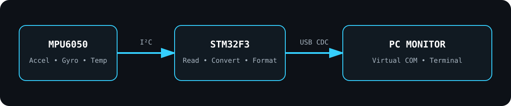

<p align="center">
  
</p>

<h1 align="center">STM32F3 MPU6050 USB CDC Monitor</h1>

<p align="center">
  <b>Read 6-axis motion data from an MPU6050 over I²C, convert the raw sensor values, and stream them from an STM32F3 to a PC through USB CDC.</b>
</p>

<p align="center">
  
  
  
  
  
</p>

---

## Project at a glance

This repository brings together the two STM32 experiments developed in the workspace:

- **MPU6050 sensor acquisition** using the STM32F3 I²C peripheral.
- **PC communication** using an STMicroelectronics Virtual COM Port / USB CDC workflow.

The recovered `GetSensorValues1` source contains the original MPU6050 driver, STM32CubeMX configuration, startup code, HAL peripheral files, and main application. A separate `integration/` folder shows a cleaner way to send the same IMU values to a PC through USB CDC.

<p align="center">
  
</p>

### Data path

```text
MPU6050
  │
  │  I²C1 — raw register data
  ▼
STM32F303VCT6
  │
  ├─ accelerometer X / Y / Z
  ├─ gyroscope X / Y / Z
  ├─ temperature
  └─ raw → physical-unit conversion
  │
  │  USB CDC
  ▼
Windows Virtual COM Port
  │
  ▼
Serial terminal / host monitor
```

---

## What the original STM32 project implements

The recovered MPU6050 source performs the following sequence:

1. Reads `WHO_AM_I` and expects `0x68`.
2. Resets and wakes the MPU6050.
3. Sets the sample-rate divider to `39`, documented in the source as **200 Hz**.
4. Configures the accelerometer for **±2 g**.
5. Configures the gyroscope for **±250 °/s**.
6. Enables the data-ready interrupt.
7. Reads **14 consecutive bytes** beginning at `ACCEL_XOUT_H`.
8. Extracts accelerometer, temperature, and gyroscope values.
9. Converts raw accelerometer values to `g` and gyroscope values to `°/s`.
10. Prints live acceleration values from the main loop when sensor data is ready.

### Sensor conversion used by the code

```text
Accelerometer ±2 g  → 16384 LSB/g
Gyroscope ±250 dps  →   131 LSB/(°/s)
Temperature         → raw / 340 + 36.53 °C
```

---

## Hardware / CubeMX configuration recovered from the project

| Item | Configuration |
|---|---|
| MCU | `STM32F303VCT6` |
| Package | `LQFP100` |
| System clock | `48 MHz` |
| I²C peripheral | `I2C1` Fast Mode |
| I²C SCL | `PB6` |
| I²C SDA | `PB7` |
| MPU6050 INT | `PB5` in the driver |
| USB DM | `PA11` |
| USB DP | `PA12` |
| USB clock | `48 MHz` |
| USART2 | `115200` in the recovered `.ioc` |
| MPU6050 7-bit address | `0x68` |
| STM32 HAL address form | `0xD0` |

> `PB6` and `PB7` are labelled for the board's I²C sensor bus in the original `.ioc`. Always verify the physical pins on the exact board before wiring.

---

## Development sessions

### MPU6050 values in STM32CubeIDE

The debugger session shows the `accel_data` array being inspected as signed 16-bit X, Y, and Z accelerometer values.

<p align="center">
  
</p>

### STM32 Virtual COM Port communication

A separate STM32 development session shows the board connected through an **STMicroelectronics Virtual COM Port** and repeatedly transmitting data to a serial terminal.

<p align="center">
  
</p>

---

## Repository structure

```text
STM32F3-MPU6050-USB-CDC-Monitor/
│
├── README.md
├── GITHUB_SETUP.md
├── STM32CUBEIDE_SETUP.md
├── .gitignore
│
├── original_source/
│   ├── GetSensorValues1.ioc
│   ├── Core/
│   │   ├── Inc/
│   │   ├── Src/
│   │   └── Startup/
│   └── STM32F303VCTX_FLASH.ld
│
├── integration/
│   ├── Core/Inc/
│   │   ├── MPU6050.h
│   │   └── mpu6050_app.h
│   ├── Core/Src/
│   │   ├── MPU6050.c
│   │   └── mpu6050_app.c
│   └── main_user_code_example.c
│
├── docs/
│   ├── BUILD_STATUS.md
│   └── PINOUT_AND_CONFIGURATION.md
│
└── assets/
    ├── repo-banner.svg
    ├── system-architecture.svg
    ├── mpu6050-debug-session.png
    └── usb-cdc-terminal.png
```

---

## Original source vs. USB CDC integration

### `original_source/`

This directory preserves the STM32 project recovered from the workspace. It is useful for inspecting the actual CubeMX setup and the original MPU6050 implementation.

### `integration/`

This directory contains a cleaned application layer that formats both raw and converted MPU6050 values and sends them using `CDC_Transmit_FS()`.

The USB CDC source project visible in the development screenshot was not present as a complete source folder in the archived workspace, so the CDC application layer here is a **clean integration based on the visible workflow**, rather than a claim that it is the exact historical source.

---

## Example USB CDC output

```text
STM32F3 MPU6050 monitor ready
RAW AX=3244 AY=-32768 AZ=15376 GX=120 GY=-42 GZ=18
UNIT AX=0.198g AY=-2.000g AZ=0.938g GX=0.916dps GY=-0.321dps GZ=0.137dps T=26.42C
```

The numbers above are an example format. Actual values depend on the sensor orientation and movement.

---

## Build / run in STM32CubeIDE

### Option A — inspect the recovered project

1. Open STM32CubeIDE.
2. Import or recreate the project using `original_source/GetSensorValues1.ioc`.
3. Check the MCU target: `STM32F303VCT6`.
4. Generate CubeMX code if required.
5. Build and flash the board.
6. Observe the MPU6050 values in the debugger or the configured output path.

### Option B — add USB CDC output

1. Open the `.ioc` in STM32CubeIDE / CubeMX.
2. Keep `I2C1` configured for the sensor.
3. Configure the MCU USB peripheral and **USB Device CDC** middleware.
4. Ensure the USB clock is **48 MHz**.
5. Generate code.
6. Copy the files from `integration/Core/Inc` and `integration/Core/Src` into the generated project.
7. Add the calls shown in `integration/main_user_code_example.c`.
8. Build and flash.
9. Open the ST Virtual COM Port from a terminal application.

More detail is available in [`STM32CUBEIDE_SETUP.md`](STM32CUBEIDE_SETUP.md).

---

## Main source calls

Original sensor initialization:

```c
MPU6050_Initialization();
```

Reading and converting all 6 axes:

```c
MPU6050_ProcessData(&MPU6050);
```

Original main-loop pattern:

```c
if (MPU6050_DataReady() == 1)
{
    MPU6050_ProcessData(&MPU6050);
    printf("%d, %d, %d\n",
           MPU6050.acc_x_raw,
           MPU6050.acc_y_raw,
           MPU6050.acc_z_raw);
}
```

USB CDC application pattern from the integration layer:

```c
MPU6050_APP_Init(&hi2c1);

while (1)
{
    MPU6050_APP_Process();
}
```

---

## Notes

- A repeated raw value of `-32768` is the minimum `int16_t` value. If it appears unexpectedly during a stationary test, inspect the I²C read, wiring, register data, and debugger timing.
- The recovered project configures USB pins and clocking, but USB **CDC middleware source** was not part of the recovered `GetSensorValues1` source tree.
- The original driver uses the global `hi2c1` handle.
- The cleaned integration includes `<stdio.h>` to avoid the original `printf` declaration warnings.

---
