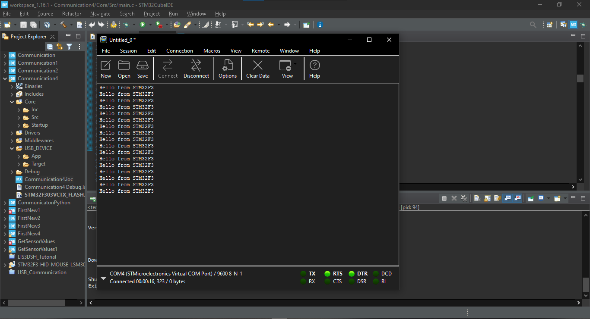
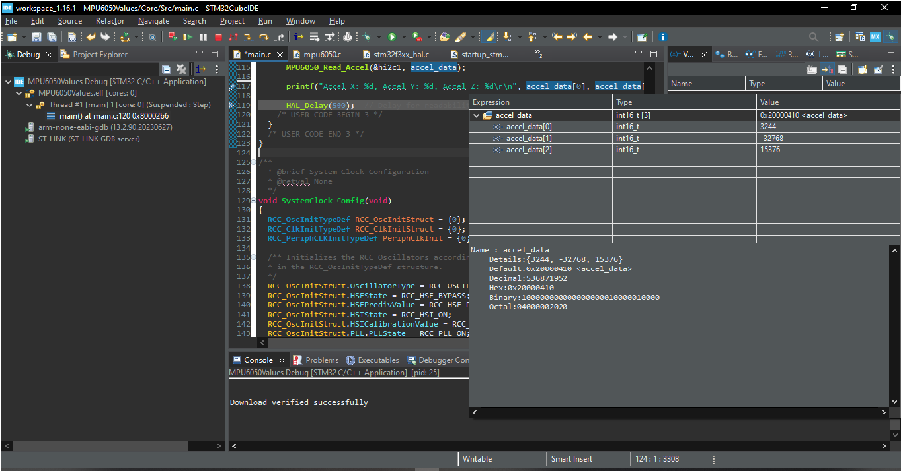

<div align="center">

# STM32F3 MPU6050 USB CDC Monitor

### Read 6-axis motion data over I²C and stream it to a PC as a Virtual COM Port

[](#)
[](#)
[](#)
[](#)
[](#)


</div>

---

## Overview

This repository combines the two development tasks visible in the screenshots:

1. **USB CDC communication** — the STM32F3 appears as a Virtual COM Port and sends text to a PC terminal.
2. **MPU6050 sensor acquisition** — the STM32F3 reads accelerometer, gyroscope, and temperature data from an MPU6050 over I²C.

The final application converts raw sensor values into engineering units and streams them to the computer every 500 ms.

```text
MPU6050
  │  I²C
  ▼
STM32F3
  │  USB CDC
  ▼
Virtual COM Port
  │
  ▼
Serial terminal / Python monitor
```

## Development snapshots

### USB CDC terminal session



### MPU6050 debug session



## Features

- STM32F303VCTx / STM32F3-oriented implementation
- MPU6050 connection over `I2C1`
- `WHO_AM_I` verification
- Accelerometer range: ±2 g
- Gyroscope range: ±250 °/s
- Raw 16-bit accelerometer and gyroscope readings
- Converted acceleration in `g` and `m/s²`
- Converted angular velocity in `°/s`
- Converted temperature in °C
- USB CDC text streaming
- Python serial monitor
- 500 ms reporting interval

## Example output

```text
STM32F3 MPU6050 USB CDC Monitor
MPU6050 detected at I2C address 0x68

RAW  AX=  3244 AY= -32768 AZ= 15376 | GX=   120 GY=   -42 GZ=    18
UNIT AX= +0.198g AY= -2.000g AZ= +0.938g | GX= +0.916dps GY= -0.321dps GZ= +0.137dps | T=+26.42C
```

A repeated raw value of `-32768` is suspicious because it is the minimum signed 16-bit value. Check the I²C read, register sequence, wiring, power, and sensor range.

## Hardware

- STM32F3 board using an STM32F303VCTx-compatible MCU
- MPU6050 module
- USB cable
- Jumper wires

### Wiring

| MPU6050 | STM32F3 |
|---|---|
| `VCC` | `3.3V` |
| `GND` | `GND` |
| `SCL` | Selected `I2C1_SCL` pin |
| `SDA` | Selected `I2C1_SDA` pin |
| `AD0` | `GND` for address `0x68` |

Exact SDA/SCL pins depend on the board and the pin assignment selected in STM32CubeMX.

## Repository structure

```text
STM32F3-MPU6050-USB-CDC-Monitor/
├── README.md
├── STM32CUBEIDE_SETUP.md
├── GITHUB_UPLOAD.md
├── requirements.txt
├── .gitignore
├── firmware/
│   ├── Core/
│   │   ├── Inc/app_mpu6050.h
│   │   └── Src/
│   │       ├── app_mpu6050.c
│   │       └── main_user_code_example.c
│   └── Drivers/MPU6050/
│       ├── mpu6050.h
│       └── mpu6050.c
├── docs/
│   ├── ARCHITECTURE.md
│   ├── TROUBLESHOOTING.md
│   └── TESTING_CHECKLIST.md
├── examples/raw_accelerometer_only.c
├── tools/serial_monitor.py
└── assets/
```

## STM32CubeIDE integration

The repository includes the complete MPU6050 driver and application layer. STM32CubeMX must generate the target-specific HAL, clock, startup, USB Device, and interrupt files because those depend on the exact board and pin selection.

Follow [STM32CUBEIDE_SETUP.md](STM32CUBEIDE_SETUP.md).

## Python serial monitor

```bash
pip install -r requirements.txt
python tools/serial_monitor.py --port COM4 --baud 9600
```

## Portfolio value

This project demonstrates embedded C, STM32 HAL, I²C register communication, signed sensor data handling, physical-unit conversion, USB CDC device communication, PC serial monitoring, and STM32CubeIDE debugging.

## Scope

The screenshots show that USB Virtual COM communication and MPU6050 accelerometer debugging were performed. The exact original `.ioc`, pins, and source files were not available, so this package provides a clean, reproducible implementation of that combined workflow rather than claiming to be the exact original project.
